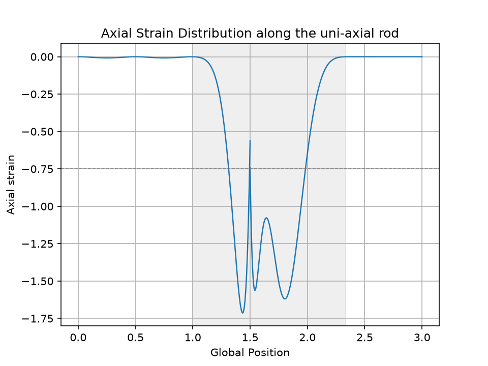
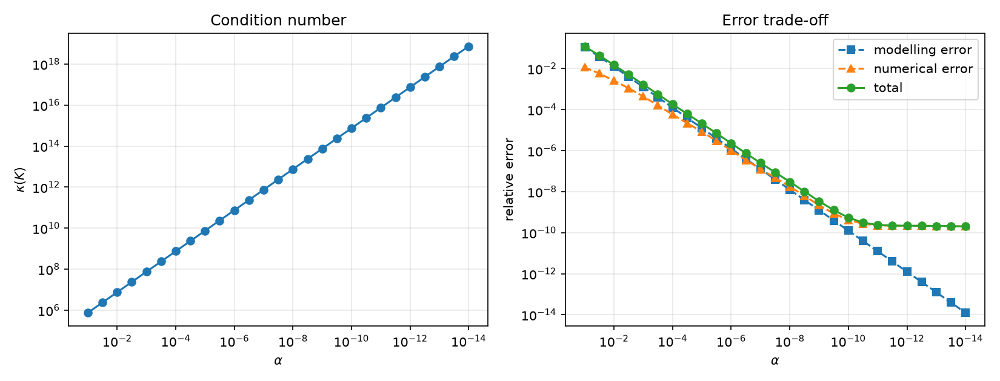

# Finite Cell Method — 1D

A from-scratch implementation of the Finite Cell Method (FCM) for the uni-axial embedded-domain
benchmark of Schillinger, Düster & Rank [3]: two physical rods separated by a fictitious domain,
discretised with two finite cells, a p-version hierarchic basis, and adaptive sub-domain quadrature.

The solver is verified against a closed-form solution to **10 significant digits**, and the
penalisation, quadrature-depth and polynomial-degree parameter spaces are characterised
quantitatively rather than assumed.

---

## At a glance

| | |
|---|---|
| Discretisation | 2 finite cells, p-version hierarchic (integrated Legendre), p = 15 → **31 DOF** |
| Quadrature | recursive bisection to `max_depth = 10` → 11 sub-domains and 176 points per cell |
| Boundary conditions | strong Dirichlet via penalty |
| Solver | dense LU (`numpy.linalg.solve`) |
| Verification | mean fictitious-domain strain **−0.74702** vs analytic **−0.747015845** |
| Conditioning | κ(K) ≈ 7.5·10⁴ / α, measured across 13 decades |
| Runtime | 0.013 s for the full benchmark |

---

## Problem


*Figure 1: uni-axial rod benchmark [3].*

| Domain | Extent | Material |
|---|---|---|
| Ω<sub>phys,1</sub> | x ∈ [0, 1] | E = 1 |
| Ω<sub>fict</sub> | x ∈ [1, 7/3] | αE, α = 10<sup>−q</sup> |
| Ω<sub>phys,2</sub> | x ∈ [7/3, 3] | E = 1 |

A = 1, ν = 0. A displacement Δu = 1 is imposed at x = 3; the left end is fixed. A distributed
axial load f<sub>sin</sub> = (1/20)·sin(4πX) acts on the first physical rod only. The default
penalisation is α = 10⁻⁸ (q = 8), as in [3].

---

## Closed-form reference

The sine load has zero resultant over [0, 1] (exactly two periods), so the internal force N₀ is
constant along the whole rod. With I = f<sub>amp</sub>/f<sub>freq</sub> = 1/(80π):

```
N₀  = (Δu + I) / ( L_phys/(EA) + L_fict/(αEA) )
ε̄_fict = N₀/(αEA) = (Δu + I) / (α·L_phys + L_fict)
u(1)   = −I = −1/(80π)
```

For α → 0 this gives **ε̄<sub>fict</sub> = −0.747015844817** and **u(1) = −3.9788736·10⁻³**.
Every number below is measured against this reference, not against a plotted curve.

---

## Verification

| Quantity | Computed | Analytic |
|---|---|---|
| u(0) | −1.33·10⁻¹³ | 0 |
| u(1) | −3.978887·10⁻³ | −3.9788736·10⁻³ |
| u(7/3) | −1.000000 | −1 |
| u(3) | −1.000000 | −1 |
| ε̄<sub>fict</sub> from displacements | −0.74702 | −0.74702 |
| ε̄<sub>fict</sub> from the strain field | −0.74693 | −0.74702 |

The last two rows are **independent code paths**: one evaluates the shape functions at two points
and differences the displacements, the other integrates the recovered strain field numerically.
Their agreement tests the consistency of K, F, the integration measure and the shape functions
simultaneously. The residual difference in the strain-field row is trapezoidal integration error
on a rapidly oscillating integrand (400 samples), not a solver error.

These six checks are automated in `check_validation.py`, which returns a non-zero exit code on
regression. They form the acceptance criteria for the planned C++ port.



*Figure 2: axial strain. The fictitious domain is shaded; the dashed line is the analytic mean.
The jump at x = 1.5 is the inter-element boundary — displacement is C⁰, strain is not.*

The oscillation inside the fictitious domain is a Gibbs-type artefact of approximating a
discontinuous strain field with high-order polynomials. Its amplitude depends on p and on the
mesh; it is **not** a physical quantity and is not a meaningful basis for comparison between
implementations. The integral over the fictitious domain is, and that is what is checked above.

---

## Parameter studies



*Figure 3: penalisation sweep, 27 values of α over 13 decades.*

### Penalisation α

| α | κ(K) | ε̄<sub>fict</sub> | rel. error |
|---|---|---|---|
| 10⁻² | 7.5·10⁶ | −0.73591009 | 2.6·10⁻³ |
| 10⁻⁴ | 7.5·10⁸ | −0.74687936 | 5.8·10⁻⁵ |
| 10⁻⁶ | 7.5·10¹⁰ | −0.74701415 | 1.0·10⁻⁶ |
| 10⁻⁸ | 7.5·10¹² | −0.74701582 | 1.8·10⁻⁸ |
| 10⁻¹⁰ | 7.5·10¹⁴ | −0.74701584 | 4.2·10⁻¹⁰ |
| 10⁻¹² | 7.5·10¹⁶ | −0.74701584 | 2.2·10⁻¹⁰ |

Condition number scales as 1/α across the entire range. The modelling error scales as 1.25α,
matching the closed form.

The expected accuracy/conditioning trade-off curve does **not** appear: the error decreases
monotonically and flattens at 2.2·10⁻¹⁰ instead of rising again. The ill-conditioning is benign
here because the small eigenvalues belong to modes supported almost entirely in the fictitious
domain, and because a direct solver is used. **This result would not carry over to an iterative
solver**, which is the relevant regime for 3D and for GPU offload.

### Quadrature depth

Residual nodal force imbalance (exact value: 0) against bisection depth:

| depth | 6 | 8 | 10 | 12 | 14 | 16 | 18 |
|---|---|---|---|---|---|---|---|
| residual | 4.8·10⁻⁸ | 3.0·10⁻⁹ | 1.9·10⁻¹⁰ | 1.2·10⁻¹¹ | 7.3·10⁻¹³ | 4.6·10⁻¹⁴ | 2.9·10⁻¹⁵ |

A factor of 16 per two levels — clean h² convergence, as expected for high-order quadrature across
a kink. The solution itself converges by depth 8; depth 10 is a safety margin. This matters for
the 3D extension, where the leaf count grows as ~4<sup>d</sup> and each leaf carries
n<sub>gauss</sub>³ points, making depth 10 infeasible.

### Polynomial degree

At α = 10⁻¹², relative error against the analytic limit:

| p | 7 | 11 | 15 |
|---|---|---|---|
| rel. error | 3.6·10⁻⁸ | 8.6·10⁻¹⁰ | 2.2·10⁻¹⁰ |

The 2.2·10⁻¹⁰ floor seen in the α sweep is therefore **discretisation error**, not round-off:
it moves with p and does not move with quadrature depth. p-convergence is algebraic rather than
exponential because the limiting strain field is discontinuous.

### Penalty parameter

Varying the Dirichlet penalty from 10³ to 10⁹ changes the result in **none of 12 significant
digits**. The boundary treatment is not a limiting factor at this problem scale.

---

## Corrections made in 2026

Verifying the hierarchic shape functions against `numpy.polynomial.legendre` exposed a defect in
the Legendre derivative recurrence. Differentiating Bonnet's relation gives

```
n·P'_n = (2n−1)·[P_{n−1} + x·P'_{n−1}] − (n−1)·P'_{n−2}
```

but the implementation carried `n·P'_{n−2}` in the last term. P'₀ = 0 masks the error at n = 2,
so it first appears at n = 3 (−1.158 instead of −0.825 at ξ = 0.3) and affected 13 of the 14 edge
modes. `check_legendre.py` guards against regression.

The same rewrite replaced the naive recursive evaluation — exponential in p, ≈42 000 function
calls per shape-function evaluation — with an upward recurrence, reducing evaluation cost from
2307 µs to 15.2 µs per call (**152×**).

Also corrected: a missing Jacobian in strain post-processing, strain values plotted on a uniform
grid rather than at their true quadrature abscissae, and a condition number reported before
constraint application (which measured the rigid-body mode rather than the physics).

---

## Known limitations

- **p ≤ 15.** Gauss points are tabulated to n = 16; higher orders silently returned empty tables
  and are now rejected in `Config`. Generating abscissae by Newton iteration removes this ceiling
  and is planned for the C++ port.
- **κ above ~10¹⁶ is not measurable** with `numpy.linalg.cond`; the last points of Figure 3
  deviate from the 1/α line for this reason, not a physical one.
- **Dense direct solve only.** Appropriate at 31 DOF; not representative of 3D.
- **1D only.**
- `MatlabModel/` contains an independent FCMLAB-based cross-check. It uses a different
  discretisation, so its fictitious-domain amplitudes differ; per the note above, that region is
  not a meaningful comparison metric.

---

## Repository layout

```
FCM1D/
  config.py               Config dataclass — model, discretisation and load parameters
  fcm_solver.py           library: solve / run / strain_field / displacement_at
  1DFCM.py                driver: benchmark, printed results, figure
  sweep_alpha.py          penalisation study → figures/alpha_sweep.png, sweep_alpha.csv
  check_validation.py     regression harness (6 checks, exit code 0/1)
  check_legendre.py       shape-function derivatives vs numpy.polynomial.legendre
  bench_shape.py          shape-function evaluation timing
  Element/                elements, nodes, edges, DOFs, shape functions, stiffness, force
  Integration/            quadrature generation, Gauss tables, mappings, DOF partitioning
  AdaptiveRefinement/     recursive bisection of cut cells
  BoundaryCondition/      strong Dirichlet, penalty algorithm
MatlabModel/              independent MATLAB cross-check
figures/
```

All parameters live in `config.py` and are threaded explicitly through the call chain as a frozen
dataclass — no module-level state — so parameter sweeps construct a new configuration rather than
mutating a shared one. Quadrature generation is separated from integration: sub-domains, weights,
global coordinates and material factors are built once per element into flat arrays, which the
assembly loops consume. Both choices are deliberate preparation for the C++/GPU port.

---

## Running

Requires Python 3 with `numpy` and `matplotlib`.

```bash
cd FCM1D
python3 1DFCM.py            # benchmark: printed results + strain figure
python3 check_validation.py # regression checks
python3 check_legendre.py   # shape-function derivative verification
python3 sweep_alpha.py      # penalisation study
```

---

## Roadmap

A faithful C++ port (CMake) is in progress, held to the same six acceptance criteria, followed by
extension to 3D — octree partitioning, per-point Jacobians, tensor-product shape functions and
STL-based inside/outside testing by ray casting — and GPU kernels with before/after performance
sweeps.

---

## References

[1] *FCMLAB: A Finite Cell Research Toolbox for MATLAB*, GitLab,
    <https://gitlab.lrz.de/cie_sam_public/fcmlab>. This implementation was developed with reference
    to FCMLAB's structure for DOF partitioning, node and edge initialisation, and adaptive
    quadrature.

[2] Zander, N.; Bog, T.; Elhaddad, M.; Espinoza, R.; Hu, H.; Joly, A.F.; Wu, C.; Zerbe, P.;
    Düster, A.; Kollmannsberger, S.; Parvizian, J.; Ruess, M.; Schillinger, D.; Rank, E.
    *FCMLab: A Finite Cell Research Toolbox for MATLAB.* Advances in Engineering Software 74,
    pp. 49–63, 2014. DOI: [10.1016/j.advengsoft.2014.04.004](https://doi.org/10.1016/j.advengsoft.2014.04.004)

[3] Schillinger, D.; Düster, A.; Rank, E. *The hp-d-adaptive finite cell method for geometrically
    nonlinear problems of solid mechanics.* International Journal for Numerical Methods in
    Engineering, vol. 89, no. 9, pp. 1171–1202, 2012.
    DOI: [10.1002/nme.3289](https://doi.org/10.1002/nme.3289)
