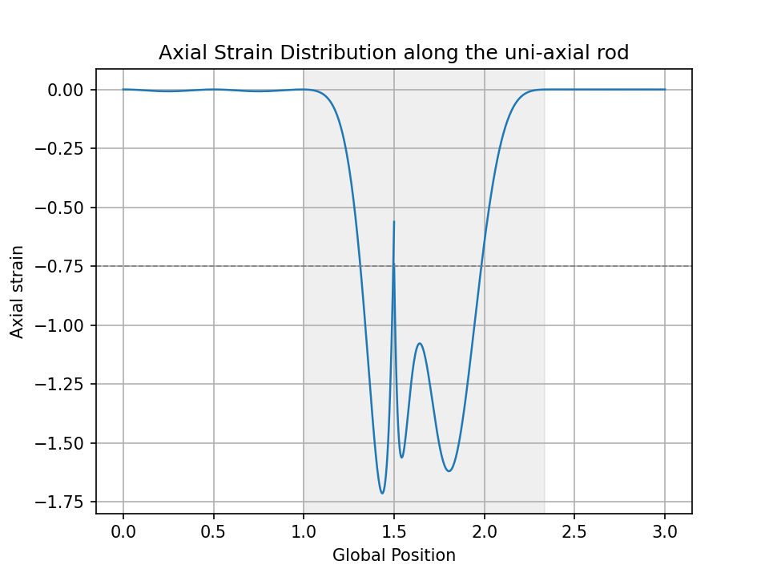
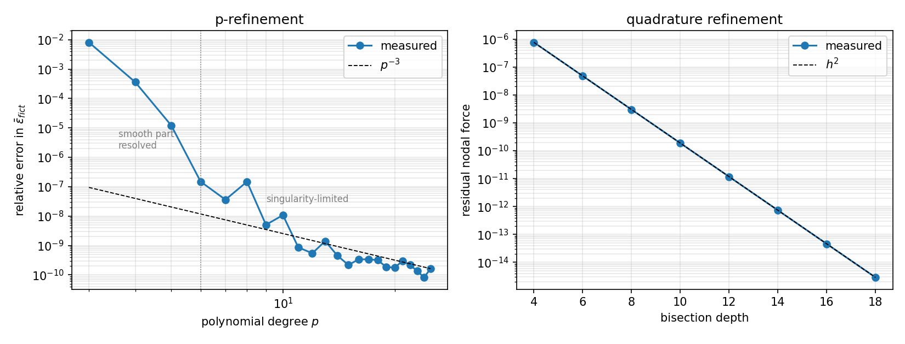

# Finite Cell Method — 1D

A from-scratch implementation of the Finite Cell Method (FCM) for the uni-axial embedded-domain
benchmark of Schillinger, Düster & Rank [3]: two physical rods separated by a fictitious domain,
discretised with two finite cells, a p-version hierarchic basis, and adaptive sub-domain
quadrature.

The repository contains a **Python reference implementation** and a **faithful C++ port**, both
verified against a closed-form solution and against each other. The penalisation, quadrature-depth
and polynomial-degree parameter spaces are characterised quantitatively rather than assumed.

---

## At a glance

| | |
|---|---|
| Discretisation | 2 finite cells, p-version hierarchic (integrated Legendre), p = 15 → **31 DOF** |
| Quadrature | recursive bisection to `max_depth = 10` → 11 sub-domains, 176 points per cell |
| Boundary conditions | strong Dirichlet via penalty |
| Solvers | Python: `numpy.linalg.solve`; C++: own partial-pivot LU |
| Verification | ε̄<sub>fict</sub> relative error **1.8·10⁻⁸** at reference settings, **8.2·10⁻¹¹** at best |
| Conditioning | κ(K) ≈ 7.5·10⁴ / α, measured across 13 decades |
| Tests | 8 CTest targets — every layer checked against reference data |
| C++ runtime | **0.170 ms** (min of 50), of which 86 % is assembly |

---

## Problem


*Figure 1: uni-axial rod benchmark [3].*

| Domain | Extent | Material |
|---|---|---|
| Ω<sub>phys,1</sub> | x ∈ [0, 1] | E = 1 |
| Ω<sub>fict</sub> | x ∈ [1, 7/3] | αE, α = 10<sup>−q</sup> |
| Ω<sub>phys,2</sub> | x ∈ [7/3, 3] | E = 1 |

A = 1, ν = 0. A displacement Δu = 1 is imposed at x = 3; the left end is fixed. A distributed
axial load f<sub>sin</sub> = (1/20)·sin(4πX) acts on the first physical rod only. The default
penalisation is α = 10⁻⁸ (q = 8), as in [3].

---

## Closed-form reference

The sine load has zero resultant over [0, 1] (exactly two periods), so the internal force N₀ is
constant along the whole rod. With I = f<sub>amp</sub>/f<sub>freq</sub> = 1/(80π):

```
N₀      = (Δu + I) / ( L_phys/(EA) + L_fict/(αEA) )
ε̄_fict  = N₀/(αEA) = (Δu + I) / (α·L_phys + L_fict)
u(1)    = −I = −1/(80π)
```

For α → 0 this gives **ε̄<sub>fict</sub> = −0.747015844817** and **u(1) = −3.9788736·10⁻³**.
Every number below is measured against this closed form, not against a plotted curve.

---

## Verification

| Quantity | Computed | Analytic |
|---|---|---|
| u(0) | −1.330034·10⁻¹³ | 0 |
| u(1) | −3.978887·10⁻³ | −3.9788736·10⁻³ |
| u(7/3) | −1.000000 | −1 |
| u(3) | −1.000000 | −1 |
| ε̄<sub>fict</sub> from displacements | −0.74702 | −0.74702 |
| ε̄<sub>fict</sub> from the strain field | −0.74693 | −0.74702 |

The last two rows are **independent code paths**: one evaluates the shape functions at two points
and differences the displacements, the other integrates the recovered strain field numerically.
Their agreement tests the consistency of K, F, the integration measure and the shape functions
simultaneously. The residual difference in the strain-field row is trapezoidal integration error
on a rapidly oscillating integrand (400 samples), not a solver error.

These six checks are automated in `check_validation.py`, which returns a non-zero exit code on
regression. The same harness validates **both** implementations — it takes the driver command as
an argument:

```bash
python3 check_validation.py                          # Python driver
python3 check_validation.py ../../build/cpp/fcm1d    # C++ driver
```

Both produce identical values to the printed precision.



*Figure 2: axial strain along the rod. The fictitious domain is shaded; the dashed line is the
analytic mean. The jump at x = 1.5 is the inter-element boundary — displacement is C⁰, strain is
not.*

The oscillation inside the fictitious domain is a Gibbs-type artefact of approximating a
discontinuous strain field with high-order polynomials. Its amplitude depends on p and on the
mesh; it is **not** a physical quantity and is not a meaningful basis for comparison between
implementations. The integral over the fictitious domain is, and that is what is checked above.

---

## Parameter studies

### Penalisation α


*Figure 3: penalisation sweep, 27 values of α over 13 decades.*

| α | κ(K) | ε̄<sub>fict</sub> | rel. error |
|---|---|---|---|
| 10⁻² | 7.5·10⁶ | −0.73591009 | 2.6·10⁻³ |
| 10⁻⁴ | 7.5·10⁸ | −0.74687936 | 5.8·10⁻⁵ |
| 10⁻⁶ | 7.5·10¹⁰ | −0.74701415 | 1.0·10⁻⁶ |
| 10⁻⁸ | 7.5·10¹² | −0.74701582 | 1.8·10⁻⁸ |
| 10⁻¹⁰ | 7.5·10¹⁴ | −0.74701584 | 4.2·10⁻¹⁰ |
| 10⁻¹² | 7.5·10¹⁶ | −0.74701584 | 2.2·10⁻¹⁰ |

Condition number scales as 1/α across the entire range; the modelling error scales as 1.25α,
matching the closed form.

The expected accuracy/conditioning trade-off curve does **not** appear: the error decreases
monotonically and flattens instead of rising again. The ill-conditioning is benign here because
the small eigenvalues belong to modes supported almost entirely in the fictitious domain, and
because a direct solver is used. **This result would not carry over to an iterative solver**,
which is the relevant regime for 3D and for GPU offload.

Above κ ≈ 10¹⁶ the condition number itself is no longer measurable: `numpy.linalg.cond` is
SVD-based and its output there varies between runs on identical input. The last points of
Figure 3 should be read as "unbounded", not as data.

### Quadrature depth and polynomial degree



*Figure 4: p-refinement (left) and quadrature refinement (right), with reference slopes.*

Residual nodal force imbalance (exact value: 0) against bisection depth:

| depth | 4 | 6 | 8 | 10 | 12 | 14 | 16 | 18 |
|---|---|---|---|---|---|---|---|---|
| residual | 7.7·10⁻⁷ | 4.8·10⁻⁸ | 3.0·10⁻⁹ | 1.9·10⁻¹⁰ | 1.2·10⁻¹¹ | 7.3·10⁻¹³ | 4.6·10⁻¹⁴ | 2.9·10⁻¹⁵ |

A factor of 16 per two levels — clean h² convergence, as expected for high-order quadrature across
a kink. The number of leaves obeys `n_leaves = max_depth + 1` for a single interior discontinuity.
The solution converges by depth 8; depth 10 is a safety margin. This matters for the 3D extension,
where the leaf count grows as ~4<sup>d</sup> and each leaf carries n<sub>gauss</sub>³ points.

Relative error against the analytic limit at α = 10⁻¹² (full sweep in `results/sweep_p.csv`):

| p | 3 | 4 | 5 | 6 | 8 | 11 | 15 | 20 | 24 |
|---|---|---|---|---|---|---|---|---|---|
| DOF | 7 | 9 | 11 | 13 | 17 | 23 | 31 | 41 | 49 |
| rel. error | 8.1·10⁻³ | 3.6·10⁻⁴ | 1.2·10⁻⁵ | 1.5·10⁻⁷ | 1.5·10⁻⁷ | 8.6·10⁻¹⁰ | 2.2·10⁻¹⁰ | 1.8·10⁻¹⁰ | 8.2·10⁻¹¹ |

Two regimes are visible. Up to p ≈ 6 each step gains a factor of 20–80: the smooth part of the
solution is being resolved. Beyond that the error follows an **algebraic p⁻³ envelope** with
superimposed oscillation in the transition region (odd degrees are favoured for p = 6…11; the
pattern dissolves above p ≈ 12).

This is the numerical signature of a C⁰ singularity located **inside** an element. For a smooth
solution, p-refinement converges exponentially; here the strain field is discontinuous at the
embedded boundary and the rate collapses to algebraic. Recovering fast convergence requires mesh
grading towards the discontinuity rather than higher p — which is precisely why reference [3] is
about *hp-d-adaptive* FCM.

### Penalty parameter

Varying the Dirichlet penalty from 10³ to 10⁹ changes the result in **none of 12 significant
digits**. The boundary treatment is not a limiting factor at this problem scale.

---

## C++ port

The port is deliberately faithful: same algorithm flow, same operation order inside the
integration loops, flat array storage in place of the Python object graph. It is verified
layer by layer against reference data dumped from the validated Python implementation
(`python/FCM1D/dump_reference.py` → `reference/*.txt`, written at full `%.17g` precision).

| Test | Checks | What it verifies |
|---|---|---|
| `test_legendre` | 320 | Legendre values/derivatives and hierarchic shape functions |
| `test_gauss` | 1940 | Gauss points and weights, plus 2n−1 exactness for n = 1…40 |
| `test_mesh` | 37 | DOF numbering and location matrices |
| `test_partition` | 46 | adaptive bisection of cut cells |
| `test_quadrature` | 356 | integration points, weights and material factors |
| `test_assembly` | 816 | element stiffness and force, plus symmetry and rigid-body checks |
| `test_solve` | 32 | solution vector and residual |
| `validation_end_to_end` | 6 | the Python harness run against the C++ driver |

Two of these do not depend on the reference data at all: Gauss quadrature is checked by
integrating monomials up to degree 2n−1 exactly, and element stiffness is checked for symmetry
and for the rigid-body property Kₑ·[1, 1, 0, …]ᵀ = 0. Both would catch an error even if the
reference files were wrong.

**Where the two implementations agree and where they don't.** Assembled K and F match to
6.1·10⁻¹⁶ relative. The solution vector differs by 3.2·10⁻⁹ — five orders of magnitude below the
κ·ε bound of 1.7·10⁻³, and explained by the different operation order of a plain LU versus
LAPACK's blocked one. The residual ‖Ku−F‖/‖F‖ is 8.0·10⁻²² in the C++ solve, confirming the
difference is conditioning, not error.

### Timing

Phase breakdown of the C++ solver, minimum of 50 runs:

| phase | time | share |
|---|---|---|
| mesh + DOF | < 1 µs | ~0 % |
| quadrature generation | 18 µs | 11 % |
| **assembly** | **146 µs** | **86 %** |
| BC + solve | 5 µs | 3 % |
| **total** | **170 µs** | |

Assembly dominates; the 31×31 dense LU is 3 % of runtime, confirming that a dense direct solver
is the right choice at this scale. The next optimisation target is therefore the assembly loop —
specifically the three heap allocations per shape-function evaluation, 1056 in total — and not
the solver.

> *Python/C++ speed-up figure pending: the Python reference timing is under investigation for a
> regression and will be quoted once resolved.*

---

## Defects found and fixed

**Legendre derivative recurrence.** Differentiating Bonnet's relation gives

```
n·P'_n = (2n−1)·[P_{n−1} + x·P'_{n−1}] − (n−1)·P'_{n−2}
```

but the implementation carried `n·P'_{n−2}` in the last term. P'₀ = 0 masks the error at n = 2, so
it first appears at n = 3 (−1.158 instead of −0.825 at ξ = 0.3) and affected 13 of the 14 edge
modes. Found by comparing against `numpy.polynomial.legendre`; `check_legendre.py` guards against
regression.

**Exponential shape-function evaluation.** The same routine used naive recursion without
memoisation, costing on the order of 10⁴ function calls per evaluation. Rewritten as an upward
recurrence, reducing evaluation cost from 2307 µs to 15.2 µs per call — a factor of **152**.

**Gauss weight transcription error.** The hardcoded 11-point rule had the outermost weight pair as
0.0556685661167360 instead of 0.0556685671161737. This was found by the **C++ port**, whose
Newton-based generator disagreed with the table; the port's independent 2n−1 exactness test
confirmed which side was right. The tables have since been replaced by generated values, which
also removed the p ≤ 15 ceiling they imposed.

**Post-processing.** A missing Jacobian in the strain recovery, strain values plotted on a uniform
grid rather than at their true abscissae, and a condition number computed before constraints were
applied — measuring the rigid-body mode rather than the physics.

---

## Known limitations

- **κ above ~10¹⁶ is not measurable** with `numpy.linalg.cond`; the last points of Figure 3
  deviate from the 1/α line for this reason, not a physical one.
- **Dense direct solve only.** Appropriate at 31 DOF; not representative of 3D.
- **Quadrature residual at the load kink.** The nodal force imbalance is −1.87·10⁻¹⁰ at depth 10;
  it converges as h² and does not limit the reported quantities.
- **1D only.**
- `MatlabRef/` contains an independent FCMLAB-based cross-check. It uses a different
  discretisation, so its fictitious-domain amplitudes differ; per the note above, that region is
  not a meaningful comparison metric.

---

## Repository layout

```
python/FCM1D/
  config.py               Config dataclass — model, discretisation and load parameters
  fcm_solver.py           library: solve / run / strain_field / displacement_at
  1DFCM.py                driver: benchmark, printed results, figure
  paths.py                repository-relative output directories
  dump_reference.py       writes reference/*.txt for the C++ tests
  check_validation.py     regression harness (6 checks, exit code 0/1, takes a driver command)
  check_legendre.py       shape-function derivatives vs numpy.polynomial.legendre
  sweep_alpha.py          penalisation study
  sweep_convergence.py    quadrature-depth and polynomial-degree studies
  bench_solve.py          Python/C++ timing comparison
  make_figures.py         convergence figure
  Element/  Integration/  AdaptiveRefinement/  BoundaryCondition/

cpp/
  include/fcm/core/       legendre, gauss, linalg          (dimension-independent)
  include/fcm/fcm1d/      config, mesh, partition, quadrature, assembly, solver
  src/                    implementations, mirroring include/
  apps/fcm1d.cpp          driver — prints the same six values as the Python driver
  tests/                  seven layer tests, no external test framework

reference/                golden files consumed by the C++ tests
results/                  sweep data (CSV)
figures/                  README figures
MatlabRef/                independent MATLAB cross-check
```

All parameters live in `Config` and are threaded explicitly through the call chain — no
module-level state, so parameter sweeps construct a new configuration rather than mutating a
shared one. Quadrature generation is separated from integration: sub-domains, weights, global
coordinates and material factors are built once per element into flat arrays which the assembly
loops consume. Both choices are deliberate preparation for the 3D and GPU work.

---

## Running

**Python** — requires `numpy` and `matplotlib`:

```bash
cd python/FCM1D
python3 1DFCM.py             # benchmark: printed results + strain figure
python3 check_validation.py  # regression checks
python3 sweep_alpha.py       # penalisation study
python3 sweep_convergence.py # depth and p studies
python3 dump_reference.py    # regenerate reference data for the C++ tests
python3 make_figures.py      # convergence figure
```

**C++** — requires CMake ≥ 3.20 and a C++17 compiler:

```bash
cmake -S . -B build -DCMAKE_BUILD_TYPE=Release
cmake --build build
ctest --test-dir build --output-on-failure
./build/cpp/fcm1d 200        # benchmark plus min-of-200 phase timing
```

---

## Roadmap

Next: extension to 3D — octree partitioning, per-point Jacobians, tensor-product shape functions,
and STL-based inside/outside testing by ray casting. The parameter studies above set the budget:
p = 15 and depth = 10 are affordable in 1D but not in 3D, where modes grow as (p+1)³ and leaves as
~4<sup>d</sup>.

Performance work follows the 3D port, since the 1D benchmark is too small for meaningful
optimisation and most of the 3D cost has no 1D counterpart. The measurement infrastructure is
already in place. Runs on NVIDIA GH200 (Grace–Hopper) hardware are planned once the 3D solver is
validated.

---

## References

[1] *FCMLAB: A Finite Cell Research Toolbox for MATLAB*, GitLab,
    <https://gitlab.lrz.de/cie_sam_public/fcmlab>. This implementation was developed with reference
    to FCMLAB's structure for DOF partitioning, node and edge initialisation, and adaptive
    quadrature.

[2] Zander, N.; Bog, T.; Elhaddad, M.; Espinoza, R.; Hu, H.; Joly, A.F.; Wu, C.; Zerbe, P.;
    Düster, A.; Kollmannsberger, S.; Parvizian, J.; Ruess, M.; Schillinger, D.; Rank, E.
    *FCMLab: A Finite Cell Research Toolbox for MATLAB.* Advances in Engineering Software 74,
    pp. 49–63, 2014. DOI: [10.1016/j.advengsoft.2014.04.004](https://doi.org/10.1016/j.advengsoft.2014.04.004)

[3] Schillinger, D.; Düster, A.; Rank, E. *The hp-d-adaptive finite cell method for geometrically
    nonlinear problems of solid mechanics.* International Journal for Numerical Methods in
    Engineering, vol. 89, no. 9, pp. 1171–1202, 2012.
    DOI: [10.1002/nme.3289](https://doi.org/10.1002/nme.3289)
